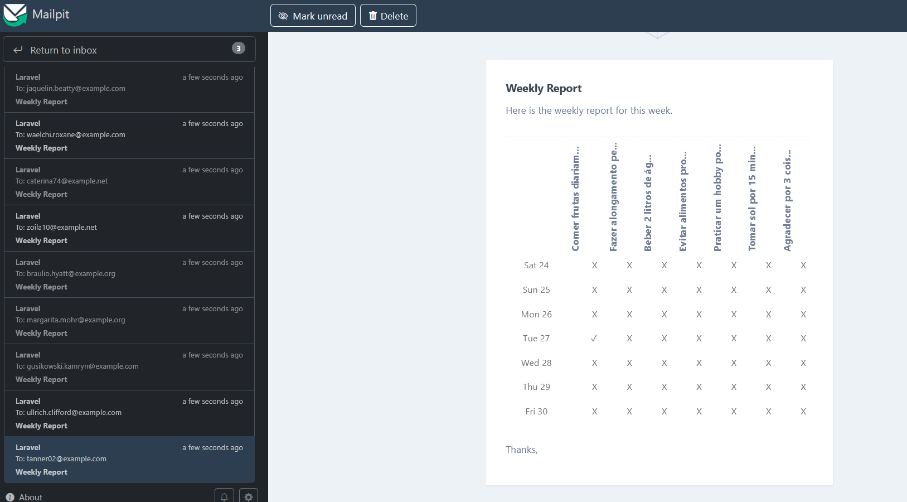

# Habit Tracker API

Este projeto foi desenvolvido com base no curso de Laravel da Rocketseat e tem como objetivo fornecer uma API RESTful para o gerenciamento de hábitos, permitindo que usuários registrem, acompanhem e mantenham seus hábitos de forma fácil e eficiente.

## Funcionalidades

- **Cadastro de usuários:** Criação e autenticação de contas de usuário.
- **Gerenciamento de hábitos:** CRUD de hábitos (criar, ler, atualizar e deletar).
- **Registro diário:** Marcar hábitos como realizados em determinados dias.
- **Histórico e progresso:** Visualização do progresso e histórico dos hábitos.
- **Notificações:** Lembretes para manter a consistência dos hábitos.

### Exemplos de Endpoints

- `POST /api/register` – Cadastro de usuário
- `POST /api/login` – Login de usuário
- `GET /api/habits/:uuid` – Listar hábito do usuário
- `POST /api/habits` – Criar novo hábito
- `PATCH /api/habits/:uuid` – Atualizar hábito
- `DELETE /api/habits/:uuid` – Remover hábito

### Exemplo da Notificação

